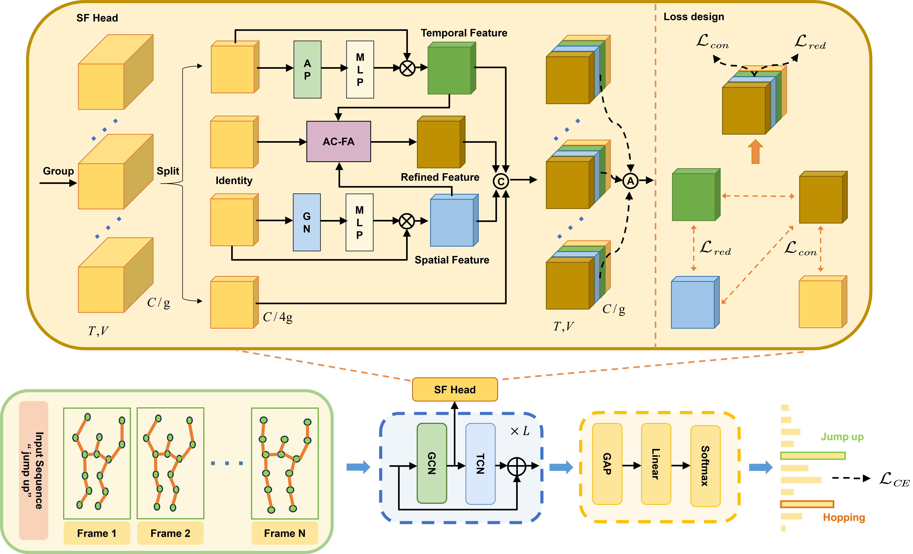

# SF-Head: Synchronized and Fine-Grained Head for Skeleton-Based Ambiguous Action Recognition
[](https://opensource.org/licenses/Apache-2.0) 
 

 

[](https://arxiv.org/abs/2412.14833) 
[](https://ietresearch.onlinelibrary.wiley.com/doi/10.1049/cvi2.70016)

## 🌟 Abstract

Skeleton-based action recognition using Graph Convolutional Networks (GCNs) has demonstrated outstanding performance. However, recognizing ambiguous actions, such as ‘waving’ and ‘saluting’, remains a significant challenge. Existing methods often rely on a sequential combination of GCNs and Temporal Convolutional Networks (TCNs), extracting spatial and temporal features independently. This results in an unbalanced spatial-temporal information interaction, hindering accurate action recognition. Moreover, current methods for ambiguous action recognition tend to overemphasize local details, which causes the loss of crucial global context, further complicating the task. To address these challenges, we propose a lightweight plug-and-play module, the **Synchronized and Fine-grained Head (SF-Head)**, which can be inserted between GCN and TCN layers. SF-Head first performs **Synchronized Spatial-Temporal Extraction (SSTE)** with a **Feature Redundancy Loss (F-RL)** to ensure a balanced interaction between spatial and temporal features. Then, it executes **Adaptive Cross-dimensional Feature Aggregation (AC-FA)** with a **Feature Consistency Loss (F-CL)**, aligning the aggregated features with their original spatial-temporal counterparts. This step effectively combines both global context and local details, enhancing the model’s ability to classify ambiguous actions. Experimental results on the NTU RGB+D 60, NTU RGB+D 120, NW-UCLA, and PKU-MMD I datasets show significant improvements in distinguishing ambiguous actions. 

## 📰 Latest News

- **[04/16/2025]** SF-Head model code are now available! Please check out the [GitHub repository](https://github.com/HaoHuang2003/SF-Head) for more details. 
- **[04/15/2025]** Our paper has been published in **IET-CV**! 🎉

## 🖼️ Architecture



Got it! Here's how you can modify the **Installation and Usage** section to clarify that the dependencies should be based on the user's specific project.

------

## ⚙️ Installation and Usage

**SF-Head** is a lightweight plug-and-play module that can be used in various domains like skeleton-based action recognition, image classification, and other tasks requiring robust spatial-temporal feature extraction and aggregation.

### To get started:

1. **Clone the repository**:

   ```bash
   git clone https://github.com/HaoHuang2003/SF-Head.git
   cd SF-Head
   ```

2. **Install dependencies**:

   Since **SF-Head** can be used in a wide range of projects (e.g., skeleton-based recognition or image classification), the dependencies may vary based on your specific project. You can either use a `requirements.txt` or `environment.yaml`.if it’s included or install dependencies manually based on your project setup.

3. **Integrate SF-Head into your architecture**:

   You can use **SF-Head** in any GCN-based model or modify it to fit your image-based model. Example usage in a GCN-based model:

   ```python
   from sf_head import SFHead
   
   # Create the SFHead module
   sf_head = SFHead(channel=64, G=8)
   
   # Example input tensor for skeleton-based or image-based task (BxCxTxV/BxCxHxW)
   input_tensor = torch.randn(96, 64, 300, 25)  # Adjust this shape based on your task
   output_tensor = sf_head(input_tensor)
   
   print(output_tensor.shape)
   ```

4. **(Optional)** For image classification or recognition tasks, you can modify your model’s existing feature aggregation block to use **SF-Head**. The module is adaptable and can replace any similar feature aggregation blocks in your architecture.

## 📑 Citation

```
@article{https://doi.org/10.1049/cvi2.70016,
author = {Huang, Hao and Lin, Yujie and Chen, Siyu and Liu, Haiyang},
title = {Synchronised and Fine-Grained Head for Skeleton-Based Ambiguous Action Recognition},
journal = {IET Computer Vision},
volume = {19},
number = {1},
pages = {e70016},
keywords = {computer vision, convolution, feature extraction, pose estimation},
doi = {https://doi.org/10.1049/cvi2.70016},
url = {https://ietresearch.onlinelibrary.wiley.com/doi/abs/10.1049/cvi2.70016},
eprint = {https://ietresearch.onlinelibrary.wiley.com/doi/pdf/10.1049/cvi2.70016},
year = {2025}
}
```

## 🙏 Acknowledgments

If you find this project useful, consider citing or starring 🌟 the repo.

Special thanks to instructors **Haiyang, Liu** for his guidance throughout this paper.

This project also benefits from insights and ideas found in related open-source efforts, including prior works:

- [Proto-GCN](https://github.com/firework8/ProtoGCN)
- [FR-Head](https://github.com/zhysora/FR-Head)
- [HYSP](https://github.com/paolomandica/HYSP)
- [CTR-GCN](https://github.com/Uason-Chen/CTR-GCN)
- [TCA-GCN](https://github.com/OrdinaryQin/TCA-GCN)
- [2s-AGCN](https://github.com/lshiwjx/2s-AGCN)
- [ST-GCN](https://github.com/yysijie/st-gcn)
- [SA-Net](https://github.com/wofmanaf/SA-Net)
- [triplet-attention](https://github.com/landskape-ai/triplet-attention)

